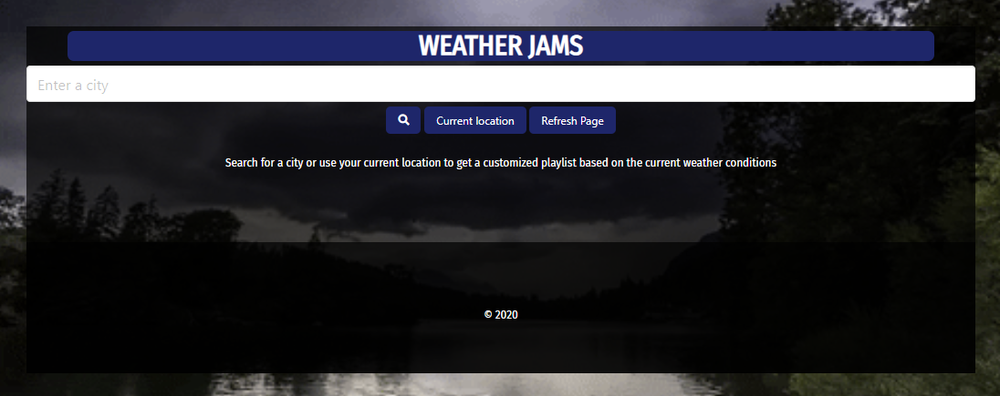
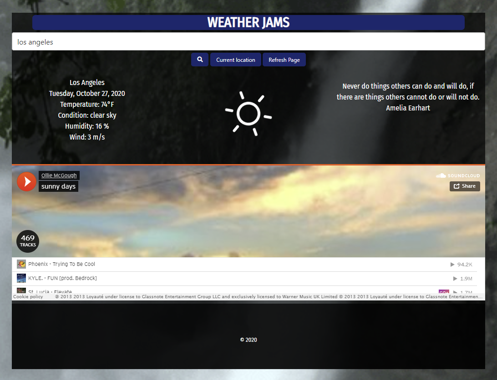

## Weather Jams - Project 1

* Alyson Bennett
* Kelsey Busser
* Ronnie Cromer
* Paris Plain
* Stephen Ross
* Jackson Smith

## Deployed Application Links and GitHub Repository

* [Link to deployed application](https://alysonbennett.github.io/Weather-Jams/)
* [Link to GitHub Repository](https://github.com/alysonbennett/Weather-Jams)

## User Story

* AS A music enthusiast that works outside
* I WANT a music playlist that matches the current weather conditions
* SO THAT I have relevant music to listen to during my work day

## Project Description

* GIVEN I am a music enthusiast that works outside
* WHEN I open the application
* THEN I insert my location or desired location
* WHEN the weather conditions are retrieved and displayed
* THEN I am provided with a customized playlist based on the current conditions

## APIs Used

* Open Weather Map
* Soundcloud

## Rough Breakdown of Tasks

Front End Design:
Kelsey, Ronnie, Alyson

Back End Coding:
Paris, Jackson, Stephen

## Process

We started this project with brainstorming ideas for what we would want our application to do, and how users would interact with it. After deciding on a type of app that would provide a playlist based on the users current weather conditions, we began searching for APIs that would fit this criteria. We also began sketching how we want the app to look, and searched for a CSS framework other than Bootstrap that would fit our needs.

The first hurdle was finding a music API that didn't require authentication or tokens, which turned out to be the most difficult step of the process. We landed on using SoundCloud, which allowed us to insert pre-made playlists based on keywords provided by the weather API.

We decided to use the OpenWeatherMap API which would give us defined parameters needed to pull playlists from SoundCloud. 

Within the app, we would need a button to find the users current location, as well as an input box for the user to search for a location if desired. We also needed to create containers for the weather information and the SoundCloud playlists. In addition, we found some animated icons that represented the current weather conditions that we felt would add a more modern look to the app. And to up the appearance just a bit more, we added animated background images that also reflects the users current weather conditions.

## Screen Shots of Final Application

This is what the user will first see when opening the application:

This is what shows after the user either allows current location or searches for a location: 

## Final Thoughts

This was a challenging project, particularly in selecting and working with an appropriate music API. Our group collaboratively using Repl.It, then moved to using GitHub to push and pull changes. It was also difficult inserting the animated icons, however, we feel that it steps up the application to look more professional.

Overall, we are happy with the deployed application. We worked well together and were able to push through difficulties as a group. We all learned a lot along the way and feel more comfortable taking these skills beyond the classroom.

## Future Development

